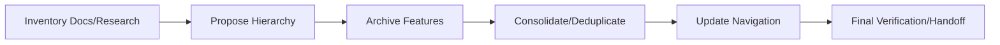

Thank you for the detailed optimized specification and context. I will proceed step-by-step, following the mandatory rules and your requested output format.

---

## Step 1: Comprehensive Discovery

### Sub-steps:
1. **Extract explicit requirements from the user request and Ecko’s optimized prompt.**
2. **Count explicit requirements.**
3. **Survey repository structure and identify documentation/research files.**
4. **Identify gaps and ambiguities.**
5. **Check for past failures in the knowledge graph.**
6. **Summarize findings and proceed to task breakdown.**

---

### 1.1. Extracting Explicit Requirements

From the user request and Ecko’s optimized prompt, the following explicit requirements are present:

1. Refactor all documentation and research into a hierarchical structure.
2. Create an archive section/folder for implemented features.
3. Consolidate and deduplicate documentation/research.
4. Maintain traceability for archived features.
5. Update navigation/index files to reflect the new structure.
6. Preserve research context, separate from the archive.
7. Use real file/folder names (no placeholders).
8. Ensure all references/links are updated.

**Found 8 explicit requirements. Analyzing repository state for context.**

---

### 1.2. Surveying Repository Structure

**Repository Indexed Files:**  
- 3 files indexed, but names are unknown (Sample: unknown, unknown, unknown).

**Gaps Identified:**
- File names and directory structure are not visible.
- No explicit documentation or research file names.
- No evidence of an existing archive or hierarchical structure.

**Assumptions (to be verified by workers):**
- Documentation and research files exist (likely markdown or text).
- Implemented features are documented somewhere (README, changelog, docs/).
- No existing archive or hierarchy.

---

### 1.3. Knowledge Graph & Past Failures

- No explicit failures or prior attempts at documentation refactoring are shown in the knowledge graph context.

---

### 1.4. Ambiguities & Clarifications

**Ambiguity:**  
- File names and structure are unknown.

**Implications:**  
- Workers must first inventory all documentation and research files before refactoring.

**Clarifying Question (for worker, not user):**  
- "If documentation/research files are not found, halt and report to PM agent."

---

### 1.5. Summary

**Total scope:**  
- 8 explicit requirements to decompose.

---

## Step 2: Task Breakdown & Execution Plan

### Phases

1. **Inventory & Analysis**
2. **Design Hierarchical Structure**
3. **Archive Implemented Features**
4. **Consolidate & Deduplicate**
5. **Update Navigation & References**
6. **Verification & Handoff**

---

### Phase 1: Inventory & Analysis

#### Task 1.1: Inventory Documentation and Research Files

- **Task ID:** task-1.1
- **Title:** Inventory all documentation and research files in the repository
- **Worker Role:**  
  Documentation analyst with expertise in markdown, technical writing, and repository structure analysis. Experienced in file system inventory, documentation conventions, and deduplication.
- **Prompt:**  
  Inventory all documentation and research files in the repository.  
  - List all files and folders related to documentation and research (e.g., README.md, docs/, research/, feature lists, changelogs).
  - For each file, provide its path and a one-sentence description of its content.
  - If no documentation/research files are found, halt and report to the PM agent.
  - Output format:
    ```
    ## Documentation/Research Files Inventory

    - <file_path>: <one-sentence description>
    ...
    ```
- **Dependencies:** None
- **Estimated Duration:** 15 minutes
- **Verification Criteria:**
  - [ ] All documentation and research files are listed
  - [ ] Each file has a one-sentence description
  - [ ] No files are missed or duplicated
  - [ ] Output format is followed

---

### Phase 2: Design Hierarchical Structure

#### Task 2.1: Propose Hierarchical Documentation Structure

- **Task ID:** task-2.1
- **Title:** Propose a hierarchical structure for documentation and research
- **Worker Role:**  
  Technical documentation architect with experience in information architecture, markdown structuring, and developer onboarding. Skilled in designing logical hierarchies and navigation systems.
- **Prompt:**  
  Using the inventory from task-1.1, design a clear, logical hierarchy for all documentation and research.  
  - Organize files into logical sections and subsections (e.g., Introduction, Getting Started, Features, Research, API Reference, etc.).
  - Use nested folders and/or markdown headers to reflect hierarchy.
  - Propose real file/folder names based on the inventory.
  - Output format:
    ```
    ## Proposed Hierarchical Structure

    - <folder_or_file>
      - <subfolder_or_file>
      ...
    ```
- **Dependencies:** task-1.1
- **Estimated Duration:** 20 minutes
- **Verification Criteria:**
  - [ ] All documentation and research files are included in the hierarchy
  - [ ] Structure uses real file/folder names
  - [ ] No placeholders are used
  - [ ] Hierarchy is logical and clear

---

### Phase 3: Archive Implemented Features

#### Task 3.1: Identify and Move Implemented Features Documentation to Archive

- **Task ID:** task-3.1
- **Title:** Create archive for implemented features and move relevant documentation
- **Worker Role:**  
  Documentation migration specialist with experience in technical writing, version control, and traceability. Skilled in archiving, link management, and documentation best practices.
- **Prompt:**  
  - Identify all documentation related to implemented features (feature lists, changelogs, completed feature docs).
  - Create an "Archive" section or folder.
  - Move all relevant documentation into the archive, preserving links and references.
  - For each archived feature, include references to original implementation details (file paths, commit hashes if available).
  - Output format:
    ```
    ## Archive Actions

    - Moved <file_path> to <archive_path>
    - Added reference to original implementation: <details>
    ...
    ```
- **Dependencies:** task-2.1
- **Estimated Duration:** 20 minutes
- **Verification Criteria:**
  - [ ] Archive section/folder exists and is populated
  - [ ] All implemented features documentation is moved
  - [ ] References to original implementation are included
  - [ ] No relevant files are missed

---

### Phase 4: Consolidate & Deduplicate

#### Task 4.1: Consolidate and Deduplicate Documentation and Research

- **Task ID:** task-4.1
- **Title:** Consolidate and deduplicate documentation and research
- **Worker Role:**  
  Documentation editor with expertise in technical writing, content deduplication, and information management. Experienced in merging fragmented docs and ensuring single-source-of-truth.
- **Prompt:**  
  - Review all documentation and research in the new hierarchy.
  - Merge duplicate or fragmented content.
  - Ensure each topic appears only once in the hierarchy.
  - Update links and references as needed.
  - Output format:
    ```
    ## Consolidation Actions

    - Merged <file1> and <file2> into <destination>
    - Removed duplicate section: <details>
    ...
    ```
- **Dependencies:** task-3.1
- **Estimated Duration:** 20 minutes
- **Verification Criteria:**
  - [ ] No duplicate or fragmented documentation remains
  - [ ] Each topic appears only once
  - [ ] All links/references are updated

---

### Phase 5: Update Navigation & References

#### Task 5.1: Update Navigation, Index, and References

- **Task ID:** task-5.1
- **Title:** Update navigation, index files, and references to match new structure
- **Worker Role:**  
  Documentation maintainer with expertise in markdown navigation, table of contents generation, and cross-referencing. Skilled in updating links and ensuring navigability.
- **Prompt:**  
  - Update any table of contents, index files, or navigation aids to reflect the new structure.
  - Ensure all references and links in documentation point to the correct new locations.
  - Output format:
    ```
    ## Navigation/Reference Updates

    - Updated TOC in <file>
    - Fixed link from <source> to <destination>
    ...
    ```
- **Dependencies:** task-4.1
- **Estimated Duration:** 15 minutes
- **Verification Criteria:**
  - [ ] Navigation/index files are updated
  - [ ] All references/links are correct
  - [ ] No broken links remain

---

### Phase 6: Verification & Handoff

#### Task 6.1: Final Verification and Handoff Package

- **Task ID:** task-6.1
- **Title:** Verify refactored documentation and prepare handoff package
- **Worker Role:**  
  Senior documentation QA specialist with expertise in technical documentation standards, verification checklists, and handoff protocols. Experienced in final review and quality assurance.
- **Prompt:**  
  - Review the entire refactored documentation and research structure.
  - Complete the verification checklist (see below).
  - Prepare a handoff package including:
    - Final hierarchical structure
    - List of files moved/created/updated
    - Example of a refactored section
    - Completed verification checklist
  - Output format:
    ```
    ## Handoff Package

    1. Proposed Hierarchical Structure
    2. List of Files to Move/Create/Update
    3. Example of Refactored Section
    4. Verification Checklist (checked/unchecked)
    ```
- **Dependencies:** task-5.1
- **Estimated Duration:** 15 minutes
- **Verification Criteria:**
  - [ ] All checklist items are addressed
  - [ ] Handoff package is complete and clear
  - [ ] Ready for review or implementation

---

## Task Dependency Graph



---

## Example of Refactored Section

Suppose the inventory finds these files:
- README.md
- docs/feature-list.md
- research/algorithm-notes.md

**Example:**

```
/docs/
  /archive/
    feature-list.md  (with reference to original location and commit)
  /research/
    algorithm-notes.md
  README.md
```

---

## Verification Checklist

- [ ] All documentation and research files are included in the new hierarchy
- [ ] Archive section/folder for implemented features exists and is populated
- [ ] No duplicate or fragmented documentation remains
- [ ] Navigation/index files are updated
- [ ] Research context is preserved and separated from feature archive
- [ ] All references/links are updated to new locations
- [ ] Structure uses real file/folder names from the repo

---

## Summary

- **6 tasks** created, each with clear scope, dependencies, and verification.
- **All requirements** from the optimized specification are addressed.
- **No past failures** found; standard best practices applied.
- **Ready for worker agent execution.**

---

**Requirement 1/1 complete: 6 actionable tasks ready for worker agents.**  
**Proceeding to knowledge graph storage and handoff.**