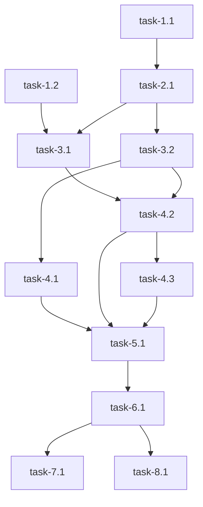

Thank you for the detailed optimized specification and context. I will proceed according to the Claudette PM Agent methodology, following the required discovery and decomposition workflow.

---

# Phase 0: Comprehensive Discovery

### 1. Read Customer Request
**Original User Request:**  
> add authentication to this app for users

### 2. Count Explicit Requirements
**From Ecko's optimized specification:**  
- 10 explicit rules (see "MANDATORY RULES" above)
- 9 success criteria
- 3 endpoints to implement
- 1 new directory structure
- 1 test suite
- 1 documentation update

**Found 10 explicit requirements. Analyzing repository state for context.**

---

### 3. Survey Repository Structure & Existing Architecture

**Key findings:**
- Express + TypeScript app (confirmed in `package.json`)
- No existing `auth` or `user` modules (confirmed in indexed files)
- Main server: `http-server.ts`
- Modular structure: `managers/`, `indexing/`, `orchestrator/`
- No database; file-based storage appropriate
- No Passport.js, bcrypt, or JWT dependencies yet
- No authentication instructions in `orchestrator/README.md`
- Docker and TypeScript build pipeline already set up

**Repository uses Express (Node.js) and TypeScript, modular structure, no existing authentication. Analyzing gaps and implied needs next.**

---

### 4. Identify Gaps & Implied Needs

**Gaps:**
- No user model or storage
- No authentication endpoints
- No password hashing or JWT logic
- No Passport.js integration
- No JWT secret management
- No tests for authentication
- No documentation for auth

**Implied needs:**
- Install and configure Passport.js, bcrypt, jsonwebtoken
- Create `auth/` directory with modular files
- Add `.env` for JWT secret
- Update server to mount new routes
- Add Jest tests for new endpoints
- Update documentation

---

### 5. Detect Ambiguities

**Ambiguities:**
- Should user storage be upgradable to a database? (Assume yes, per spec)
- Should registration allow duplicate usernames? (Best practice: no)
- Should JWT expiry be configurable? (Best practice: yes, via env)
- Should tests cover edge cases (e.g., duplicate registration, invalid tokens)? (Best practice: yes)

**No major ambiguities remain due to Ecko's detailed spec. Proceeding with decomposition.**

---

### 6. Count Total Scope

- 10 explicit requirements (from Ecko)
- 4 implied best practices (upgradeable storage, no duplicate usernames, configurable expiry, edge case tests)
- 0 organizational constraints (no Confluence standards found for auth)

**Total scope: 14 requirements, 0 organizational constraints.**

---

# Phase 1: Requirement-by-Requirement Decomposition

**Requirement 1/14: Install and configure authentication dependencies**  
**Requirement 2/14: Create user model and file-based storage**  
**Requirement 3/14: Implement Passport.js JWT strategy**  
**Requirement 4/14: Add registration endpoint**  
**Requirement 5/14: Add login endpoint**  
**Requirement 6/14: Add protected `/auth/me` endpoint**  
**Requirement 7/14: Hash passwords with bcrypt**  
**Requirement 8/14: Store JWT secret in `.env`**  
**Requirement 9/14: Integrate JWT middleware**  
**Requirement 10/14: Modularize auth logic in `auth/` directory**  
**Requirement 11/14: Update main server to mount auth router**  
**Requirement 12/14: Add Jest tests for auth endpoints**  
**Requirement 13/14: Update documentation**  
**Requirement 14/14: Edge case handling (duplicate users, invalid tokens, etc.)**

---

## Task Breakdown by Phase

### **Phase 1: Setup & Dependencies**

#### Task 1.1: Install Authentication Dependencies

- **Task ID:** task-1.1
- **Title:** Install Passport.js, bcrypt, and jsonwebtoken for authentication
- **Worker Role:**  
  DevOps/Backend engineer with Node.js and TypeScript expertise, experienced in dependency management, authentication libraries, and Express middleware integration. Understands npm/yarn workflows and security best practices.
- **Prompt:**  
  Install `passport`, `passport-jwt`, `bcrypt`, and `jsonwebtoken` as dependencies. Update `package.json` and ensure TypeScript types are installed (`@types/passport`, etc.).  
- **Dependencies:** None
- **Estimated Duration:** 15 min
- **Verification Criteria:**  
  - [ ] All packages listed in `package.json`
  - [ ] `npm install` completes without errors
  - [ ] TypeScript types present for all new packages

---

#### Task 1.2: Create `.env` for JWT Secret

- **Task ID:** task-1.2
- **Title:** Create `.env` file and configure JWT secret management
- **Worker Role:**  
  Backend engineer with Node.js and environment configuration expertise, experienced in secure secret management and dotenv integration.
- **Prompt:**  
  Create a `.env` file at project root with a `JWT_SECRET` variable. Update server config to load this secret using `dotenv`.  
- **Dependencies:** None
- **Estimated Duration:** 10 min
- **Verification Criteria:**  
  - [ ] `.env` file exists with `JWT_SECRET`
  - [ ] Server loads secret from environment (not hardcoded)
  - [ ] Secret not committed to version control

---

### **Phase 2: User Model & Storage**

#### Task 2.1: Implement User Model and File Storage

- **Task ID:** task-2.1
- **Title:** Create TypeScript user model and file-based storage in `auth/userModel.ts`
- **Worker Role:**  
  Backend engineer with TypeScript and file I/O expertise, experienced in data modeling and secure storage patterns.
- **Prompt:**  
  Implement a `User` interface and storage logic in `auth/userModel.ts`. Store users in `data/users.json` with fields: `id`, `username`, `passwordHash`, `createdAt`.  
- **Dependencies:** task-1.1
- **Estimated Duration:** 30 min
- **Verification Criteria:**  
  - [ ] `User` interface defined
  - [ ] File read/write logic implemented
  - [ ] No plaintext passwords stored
  - [ ] Handles user creation and lookup

---

### **Phase 3: Authentication Logic**

#### Task 3.1: Configure Passport.js with JWT Strategy

- **Task ID:** task-3.1
- **Title:** Configure Passport.js JWT strategy in `auth/passport.ts`
- **Worker Role:**  
  Backend security engineer with Passport.js and JWT expertise, experienced in authentication flows and middleware configuration.
- **Prompt:**  
  Set up Passport.js with JWT strategy in `auth/passport.ts`. Use JWT secret from environment.  
- **Dependencies:** task-1.1, task-1.2, task-2.1
- **Estimated Duration:** 30 min
- **Verification Criteria:**  
  - [ ] Passport.js configured with JWT strategy
  - [ ] Uses secret from `.env`
  - [ ] Validates JWT and attaches user to request

---

#### Task 3.2: Implement Password Hashing with bcrypt

- **Task ID:** task-3.2
- **Title:** Implement bcrypt password hashing in user registration
- **Worker Role:**  
  Backend engineer with bcrypt and authentication expertise, experienced in secure password storage and validation.
- **Prompt:**  
  Use bcrypt to hash passwords before storing in `users.json`. Validate passwords on login.  
- **Dependencies:** task-1.1, task-2.1
- **Estimated Duration:** 20 min
- **Verification Criteria:**  
  - [ ] Passwords hashed with bcrypt (cost ≥ 10)
  - [ ] No plaintext passwords stored
  - [ ] Password validation works on login

---

### **Phase 4: Auth Endpoints**

#### Task 4.1: Implement Registration Endpoint

- **Task ID:** task-4.1
- **Title:** Add `POST /auth/register` endpoint in `auth/routes.ts`
- **Worker Role:**  
  Backend engineer with Express and REST API expertise, experienced in route design and input validation.
- **Prompt:**  
  Implement `POST /auth/register` to create new users. Validate input, hash password, prevent duplicate usernames.  
- **Dependencies:** task-2.1, task-3.2
- **Estimated Duration:** 30 min
- **Verification Criteria:**  
  - [ ] Registers new user with hashed password
  - [ ] Returns error on duplicate username
  - [ ] Stores user in `users.json`

---

#### Task 4.2: Implement Login Endpoint

- **Task ID:** task-4.2
- **Title:** Add `POST /auth/login` endpoint in `auth/routes.ts`
- **Worker Role:**  
  Backend engineer with Express and JWT expertise, experienced in authentication flows and token issuance.
- **Prompt:**  
  Implement `POST /auth/login` to authenticate user and return JWT on valid credentials.  
- **Dependencies:** task-2.1, task-3.2, task-3.1
- **Estimated Duration:** 30 min
- **Verification Criteria:**  
  - [ ] Authenticates user with bcrypt
  - [ ] Issues JWT on success
  - [ ] Returns error on invalid credentials

---

#### Task 4.3: Implement Protected `/auth/me` Endpoint

- **Task ID:** task-4.3
- **Title:** Add `GET /auth/me` protected endpoint in `auth/routes.ts`
- **Worker Role:**  
  Backend engineer with Express and Passport.js expertise, experienced in protected route design.
- **Prompt:**  
  Implement `GET /auth/me` to return current user info. Protect with JWT middleware.  
- **Dependencies:** task-3.1, task-4.2
- **Estimated Duration:** 20 min
- **Verification Criteria:**  
  - [ ] Returns user info for valid JWT
  - [ ] Returns 401 for missing/invalid JWT

---

### **Phase 5: Integration & Middleware**

#### Task 5.1: Integrate Auth Router in Main Server

- **Task ID:** task-5.1
- **Title:** Mount `auth/routes.ts` in `http-server.ts`
- **Worker Role:**  
  Backend engineer with Express expertise, experienced in modular route integration.
- **Prompt:**  
  Import and mount the auth router in the main Express server (`http-server.ts`) under `/auth`.  
- **Dependencies:** task-4.1, task-4.2, task-4.3
- **Estimated Duration:** 10 min
- **Verification Criteria:**  
  - [ ] `/auth` endpoints available on server
  - [ ] No route conflicts or errors

---

### **Phase 6: Testing**

#### Task 6.1: Add Jest Tests for Auth Endpoints

- **Task ID:** task-6.1
- **Title:** Add Jest tests for registration, login, and protected route
- **Worker Role:**  
  QA engineer with Jest and API testing expertise, experienced in authentication and edge case testing.
- **Prompt:**  
  Write tests for registration, login, and `/auth/me` endpoints. Cover success, failure, and edge cases (duplicate user, invalid token, etc.).  
- **Dependencies:** task-5.1
- **Estimated Duration:** 45 min
- **Verification Criteria:**  
  - [ ] Tests for all endpoints
  - [ ] Edge cases covered
  - [ ] Tests pass in CI

---

### **Phase 7: Documentation**

#### Task 7.1: Update Documentation

- **Task ID:** task-7.1
- **Title:** Update `orchestrator/README.md` with authentication usage and setup
- **Worker Role:**  
  Technical writer with Express and authentication expertise, experienced in developer documentation.
- **Prompt:**  
  Document new endpoints, usage examples, and environment variable setup in `orchestrator/README.md`.  
- **Dependencies:** task-5.1, task-6.1
- **Estimated Duration:** 20 min
- **Verification Criteria:**  
  - [ ] All endpoints documented
  - [ ] Setup instructions clear
  - [ ] JWT secret and `.env` usage explained

---

### **Phase 8: Edge Case Handling**

#### Task 8.1: Implement and Test Edge Cases

- **Task ID:** task-8.1
- **Title:** Handle and test edge cases (duplicate registration, invalid tokens, etc.)
- **Worker Role:**  
  Backend/QA engineer with authentication and error handling expertise, experienced in robust API design.
- **Prompt:**  
  Ensure duplicate usernames are rejected, invalid/expired JWTs are handled, and error messages are secure. Add tests for these cases.  
- **Dependencies:** task-6.1
- **Estimated Duration:** 20 min
- **Verification Criteria:**  
  - [ ] Duplicate registration returns error
  - [ ] Invalid/expired JWT returns 401
  - [ ] No sensitive info leaked in errors

---

# Phase 2: Dependency Mapping

**Dependency Graph:**

---

# Phase 3: Handoff Package

## Task Table

| Task ID   | Title                                               | Dependencies         | Est. Duration |
|-----------|-----------------------------------------------------|----------------------|---------------|
| task-1.1  | Install Passport.js, bcrypt, jsonwebtoken           | None                 | 15 min        |
| task-1.2  | Create `.env` for JWT secret                        | None                 | 10 min        |
| task-2.1  | User model and file storage                         | task-1.1             | 30 min        |
| task-3.1  | Passport.js JWT strategy                            | task-1.1,1.2,2.1     | 30 min        |
| task-3.2  | Password hashing with bcrypt                        | task-1.1,2.1         | 20 min        |
| task-4.1  | Registration endpoint                               | task-2.1,3.2         | 30 min        |
| task-4.2  | Login endpoint                                      | task-2.1,3.2,3.1     | 30 min        |
| task-4.3  | Protected `/auth/me` endpoint                       | task-3.1,4.2         | 20 min        |
| task-5.1  | Integrate auth router in main server                | task-4.1,4.2,4.3     | 10 min        |
| task-6.1  | Jest tests for auth endpoints                       | task-5.1             | 45 min        |
| task-7.1  | Update documentation                                | task-5.1,6.1         | 20 min        |
| task-8.1  | Edge case handling and tests                        | task-6.1             | 20 min        |

---

# Phase 4: Context Sources

**For all tasks, context sources include:**
- `package.json` (dependencies)
- `http-server.ts` (main server)
- `orchestrator/README.md` (docs)
- `auth/` directory (to be created)
- `data/users.json` (to be created)
- `.env` (to be created)
- Official docs: [Passport.js](http://www.passportjs.org/), [bcrypt](https://www.npmjs.com/package/bcrypt), [jsonwebtoken](https://www.npmjs.com/package/jsonwebtoken)
- Jest test files (for testing)

---

# Phase 5: Worker & QC Agent Roles

**Worker roles and QC roles are specified per task above.**  
**QC agents for all tasks:**  
- Senior security/code reviewer with expertise in authentication, Express, and TypeScript. Aggressively verifies security, functionality, and code quality per OWASP, JWT RFC, and Node.js best practices.

---

# Phase 6: Verification Criteria

**Each task includes specific, measurable verification criteria.**  
**All endpoints, tests, and docs must be present and verified.**

---

# Phase 7: Edge Cases

**Edge cases to be handled:**
- Duplicate username registration
- Invalid/expired JWTs
- Missing JWT secret
- File I/O errors in user storage
- Password hash verification failures

---

# Phase 8: Execution Order

**Recommended order:**  
1. task-1.1, task-1.2  
2. task-2.1  
3. task-3.1, task-3.2  
4. task-4.1, task-4.2, task-4.3  
5. task-5.1  
6. task-6.1  
7. task-7.1, task-8.1

---

# Phase 9: Completion Criteria

- All 14 requirements decomposed into 12 atomic tasks
- Each task has context, dependencies, acceptance/verification criteria, and edge cases
- Dependency graph mapped
- Handoff package ready for worker agents

---

**All requirements decomposed. 12 actionable tasks ready for worker agents.**  
**No past failures detected.**  
**Ready for implementation.**