# Authentication Touchpoints - Implementation Reference

**Version**: 1.0.0  
**Date**: 2025-11-21  
**Purpose**: Quick reference for implementing authentication across Mimir

---

## 🎯 Authentication Flow Diagram

```mermaid
graph LR
    subgraph Users["👥 Users"]
        User[End User]
    end

    subgraph IdP["🔐 Identity Providers"]
        OAuth[Okta / Auth0 / Azure / Google]
    end

    subgraph Mimir["🏛️ Mimir Server"]
        Auth[Auth Middleware]
        APIs[Protected APIs]
        Redis[(Session Store)]
    end

    subgraph Services["🔧 Downstream Services"]
        PCTX[PCTX]
        Tools[Other Tools]
    end

    %% User Flow
    User -->|1. Login| OAuth
    OAuth -->|2. OAuth Token| Auth
    Auth -->|3. Validate & Store| Redis
    Auth -->|4. Access| APIs

    %% Service Flow
    PCTX -->|API Key| Auth
    Tools -->|API Key| Auth

    %% Styling (Dark Mode Compatible)
    classDef userStyle fill:#1a237e,stroke:#3f51b5,stroke-width:3px,color:#fff
    classDef idpStyle fill:#e65100,stroke:#ff6f00,stroke-width:3px,color:#fff
    classDef mimirStyle fill:#1b5e20,stroke:#4caf50,stroke-width:3px,color:#fff
    classDef serviceStyle fill:#4a148c,stroke:#9c27b0,stroke-width:3px,color:#fff

    class User userStyle
    class OAuth idpStyle
    class Auth,APIs,Redis mimirStyle
    class PCTX,Tools serviceStyle
```



### Two Simple Flows:

**1. User Authentication (OAuth)**
```
User → OAuth Provider → Mimir validates token → Access granted
```

**2. Service Authentication (API Key)**
```
PCTX/Tools → API Key → Mimir validates → Access granted
```

---

## 📋 Implementation Touchpoints

### Files to Create

| File | Purpose | Priority | Lines of Code |
|------|---------|----------|---------------|
| `src/config/passport.ts` | Passport.js configuration (OAuth + API key strategies) | **HIGH** | ~80 lines |
| `src/api/auth-api.ts` | Auth endpoints (`/auth/login`, `/auth/callback`, `/auth/logout`) | **HIGH** | ~40 lines |
| `src/middleware/auth.ts` | Auth middleware using Passport | **HIGH** | ~20 lines |
| `src/api/api-keys-api.ts` | API key management (create, list, revoke) | **MEDIUM** | ~50 lines |
| `src/http-server.ts` | Initialize Passport | **HIGH** | ~10 lines |

**Total**: ~200 lines of code vs ~1000+ lines custom implementation

**Simplified with Passport.js**: 
- ✅ No custom OAuth flow implementation
- ✅ No manual JWT validation
- ✅ No token management code
- ✅ No provider abstraction layers
- ✅ Passport handles everything automatically

### Files to Modify

| File | Changes Required | Impact |
|------|------------------|--------|
| `src/http-server.ts` | Add `authMiddleware` to all routes (except `/health`) | **HIGH** |
| `src/api/nodes-api.ts` | Extract user context from `req.user` (set by auth middleware) | **MEDIUM** |
| `src/api/orchestration-api.ts` | Extract user context from `req.user` | **MEDIUM** |
| `src/index.ts` (MCP) | Add authentication check for MCP tools | **MEDIUM** |
| `docker-compose.yml` | Add Redis service for token storage | **HIGH** |
| `.env` / `env.example` | Add all OAuth environment variables | **HIGH** |
| `package.json` | Add dependencies: `jsonwebtoken`, `jwks-rsa`, `express-session`, `connect-redis` | **HIGH** |

---

## 🔄 Authentication Flow by Use Case

### Use Case 1: User Logs In (OAuth)

```
1. User → Mimir: GET /auth/login
2. Mimir → IdP: 302 Redirect to IdP login page
3. User → IdP: Authenticate (username/password/MFA)
4. IdP → Mimir: 302 Redirect to /auth/callback?code=xxx&state=yyy
5. Mimir → IdP: POST /token (exchange code for tokens)
6. IdP → Mimir: {access_token, refresh_token, id_token}
7. Mimir → Redis: Store tokens
8. Mimir → User: Set session cookie + return Mimir JWT
```

**Files Involved**:
- `src/api/auth-api.ts` (endpoints)
- `src/middleware/oauth.ts` (OAuth flow)
- `src/utils/token-validator.ts` (validate tokens)
- `src/config/oauth-providers.ts` (provider config)

### Use Case 2: User Accesses Protected API

```
1. User → Mimir: GET /api/nodes/query (with session cookie)
2. Mimir (auth middleware): Extract session from cookie
3. Mimir (auth middleware): Load tokens from Redis
4. Mimir (auth middleware): Validate token expiration
5. Mimir (auth middleware): Set req.user = {id, email, roles}
6. Mimir (nodes-api): Process request with user context
7. Mimir → User: Return response
```

**Files Involved**:
- `src/middleware/auth.ts` (authentication check)
- `src/http-server.ts` (apply middleware)
- `src/api/nodes-api.ts` (use `req.user`)

### Use Case 3: PCTX Authenticates with API Key (Simplified)

```
1. PCTX → Mimir: GET /mcp (with X-API-Key: your-api-key)
2. Mimir (auth middleware): Validate API key against stored keys
3. Mimir (auth middleware): Set req.user = {service: 'pctx'}
4. Mimir → PCTX: Return MCP tools
```

**Files Involved**:
- `src/middleware/auth.ts` (validate API key)

**Simplified**: No token issuance, no JWT creation, no service accounts. Just API key validation.

### Use Case 4: Token Refresh

```
1. User → Mimir: GET /api/nodes/query (with expired access token)
2. Mimir (auth middleware): Detect token expiration
3. Mimir → User: 401 Unauthorized {error: "token_expired"}
4. User → Mimir: POST /auth/refresh (with refresh token)
5. Mimir → IdP: POST /token (refresh_token grant)
6. IdP → Mimir: {access_token, refresh_token (new)}
7. Mimir → Redis: Update stored tokens
8. Mimir → User: {access_token, expires_in}
9. User → Mimir: Retry original request with new token
```

**Files Involved**:
- `src/api/auth-api.ts` (`/auth/refresh` endpoint)
- `src/middleware/oauth.ts` (token refresh logic)
- `src/utils/token-validator.ts` (validate refresh token)

---

## 🔧 Configuration Touchpoints

### Environment Variables (35 new variables)

**Location**: `.env`, `env.example`, `docker-compose.yml`

| Category | Count | Examples |
|----------|-------|----------|
| **Feature Flags** | 2 | `MIMIR_ENABLE_SECURITY`, `MIMIR_DEFAULT_AUTH_METHOD` |
| **OAuth Provider** | 8 | `MIMIR_AUTH_PROVIDER`, `MIMIR_OAUTH_ISSUER`, `MIMIR_OAUTH_CLIENT_ID` |
| **Token Management** | 5 | `MIMIR_JWT_SECRET`, `MIMIR_ACCESS_TOKEN_LIFETIME`, `MIMIR_TOKEN_STORAGE` |
| **Stateless Auth** | 2 | `MIMIR_JWT_SECRET`, `MIMIR_OAUTH_ISSUER` |
| **Service Accounts** | 5 | `MIMIR_ENABLE_SERVICE_ACCOUNTS`, `MIMIR_SERVICE_ACCOUNT_TOKEN_LIFETIME` |
| **Security Features** | 3 | `MIMIR_OAUTH_ENABLE_PKCE`, `MIMIR_OAUTH_ENABLE_STATE` |

**See**: [Security Environment Variables](./SECURITY_ENVIRONMENT_VARIABLES.md)

### Docker Compose Changes

**Add Redis Service**:
```yaml
services:
  redis:
    image: redis:7-alpine
    ports:
      - "6379:6379"
    volumes:
      - redis_data:/data
    command: redis-server --appendonly yes

volumes:
  redis_data:
```

**Update Mimir Service**:
```yaml
services:
  mimir_server:
    environment:
      # Add all 35 OAuth environment variables
      - MIMIR_ENABLE_SECURITY=${MIMIR_ENABLE_SECURITY:-false}
      - MIMIR_AUTH_METHODS=${MIMIR_AUTH_METHODS:-api-key}
      # ... (see SECURITY_ENVIRONMENT_VARIABLES.md)
    depends_on:
      - neo4j
      - redis  # NEW
```

### Package Dependencies

**Add to `package.json`**:
```json
{
  "dependencies": {
    "jsonwebtoken": "^9.0.2",
    "jwks-rsa": "^3.1.0",
    "express-session": "^1.18.0",
    "connect-redis": "^7.1.0",
    "redis": "^4.6.0",
    "passport": "^0.7.0",
    "passport-oauth2": "^1.8.0"
  }
}
```

---

## 🎯 Implementation Checklist

### Week 1: Basic OAuth with Passport.js (One Provider)

- [ ] Install Passport.js: `npm install passport passport-oauth2 express-session connect-redis`
- [ ] Create `src/config/passport.ts` (Passport config with OAuth strategy - 50 lines)
- [ ] Create `src/api/auth-api.ts` (`/auth/login`, `/auth/callback`, `/auth/logout` - 40 lines)
- [ ] Create `src/middleware/auth.ts` (Passport middleware - 20 lines)
- [ ] Modify `src/http-server.ts` (initialize Passport - 10 lines)
- [ ] Add Redis to `docker-compose.yml`
- [ ] Add **5 OAuth env vars** to `.env` and `env.example` (vs 15+ custom)
- [ ] Test OAuth login with Okta

**Total**: ~120 lines of code vs ~400+ lines custom

### Week 2: Multi-Provider Support with Passport Strategies

- [ ] Install provider strategies: `npm install passport-okta-oauth passport-auth0 passport-azure-ad passport-google-oauth20`
- [ ] Add Auth0 strategy to `src/config/passport.ts` (10 lines)
- [ ] Add Azure AD strategy to `src/config/passport.ts` (10 lines)
- [ ] Add Google strategy to `src/config/passport.ts` (10 lines)
- [ ] Add provider selection logic (20 lines)
- [ ] Test all providers

**Total**: ~50 lines of code vs ~200+ lines custom (provider implementations)

### Week 3: API Key Management with Passport

- [ ] Create custom Passport API key strategy in `src/config/passport.ts` (30 lines)
- [ ] Create `src/api/api-keys-api.ts` (create, list, revoke API keys - 50 lines)
- [ ] Configure Passport to support both OAuth and API keys (5 lines)
- [ ] Test PCTX authentication with API key

**Total**: ~85 lines of code vs ~150+ lines custom

### Week 4: Token Management

- [ ] Create `src/api/token-api.ts` (token introspection, revocation)
- [ ] Create `src/jobs/token-cleanup.ts` (cleanup expired tokens)
- [ ] Create `src/utils/token-monitor.ts` (monitoring)
- [ ] Add token refresh logic to `src/api/auth-api.ts`
- [ ] Add metrics endpoints
- [ ] Production testing

---

## 📊 Quick Reference Table

| Component | Location | Incoming | Outgoing | Purpose |
|-----------|----------|----------|----------|---------|
| **Auth Middleware** | `src/middleware/auth.ts` | HTTP requests | `req.user` object | Validate API keys or OAuth tokens |
| **OAuth Handler** | `src/middleware/oauth.ts` | OAuth callbacks | Tokens to Redis | Handle OAuth 2.0 flow |
| **Token Validator** | `src/utils/token-validator.ts` | OAuth JWT tokens | Validation result | Validate JWT signatures against IdP JWKS |
| **Auth API** | `src/api/auth-api.ts` | `/auth/*` requests | Tokens, redirects | OAuth endpoints (login, callback, refresh) |
| **API Keys API** | `src/api/api-keys-api.ts` | API key requests | API keys | Create, list, revoke API keys |
| **Redis** | Docker service | Token storage requests | Stored tokens | Persist OAuth tokens, sessions |
| **HTTP Server** | `src/http-server.ts` | All HTTP requests | Protected responses | Apply auth middleware to routes |
| **PCTX** | External (port 8080) | API Key | MCP requests | Downstream service authentication |

**Simplified**: Removed JWT issuer, service account API. Direct OAuth validation + simple API keys.

---

## 🔒 Security Checkpoints

### Checkpoint 1: Request Entry
- **Location**: `src/http-server.ts`
- **Check**: Is `MIMIR_ENABLE_SECURITY=true`?
- **Action**: Apply `authMiddleware` to all routes except `/health`

### Checkpoint 2: Token Validation
- **Location**: `src/middleware/auth.ts`
- **Check**: Valid API key, OAuth token, or Mimir JWT?
- **Action**: Set `req.user` or return 401 Unauthorized

### Checkpoint 3: Token Expiration
- **Location**: `src/utils/token-validator.ts`
- **Check**: Token expired?
- **Action**: Return 401 with `token_expired` error

### Checkpoint 4: User Context
- **Location**: `src/api/nodes-api.ts`, `src/api/orchestration-api.ts`
- **Check**: `req.user` exists?
- **Action**: Use user context for audit logging, RBAC

### Checkpoint 5: Service Account Permissions
- **Location**: `src/middleware/auth.ts`
- **Check**: Service account has required permissions?
- **Action**: Allow or deny based on permissions

---

---

## 📊 Passport.js Benefits Summary

### Code Reduction

| Metric | Custom Implementation | With Passport.js | Savings |
|--------|----------------------|------------------|---------|
| **Total Lines of Code** | ~1,000+ lines | ~255 lines | **75% reduction** |
| **Files to Create** | 13 files | 5 files | **62% fewer files** |
| **Environment Variables** | ~25 variables | ~10 variables | **60% fewer vars** |
| **Implementation Time** | 4 weeks | 3 weeks | **25% faster** |
| **Maintenance Burden** | High (custom OAuth code) | Low (Passport updates) | **Significantly lower** |

### What Passport.js Handles Automatically

- ✅ **OAuth 2.0 Authorization Code Flow** - Complete implementation
- ✅ **PKCE** - Proof Key for Code Exchange (security)
- ✅ **State Parameter** - CSRF protection
- ✅ **Nonce Validation** - Replay attack prevention (OIDC)
- ✅ **JWT Signature Validation** - Against IdP JWKS
- ✅ **Token Refresh** - Automatic refresh token handling
- ✅ **Session Management** - With Redis/memory stores
- ✅ **Provider Auto-Discovery** - `.well-known/openid-configuration`
- ✅ **Multiple Strategies** - OAuth + API keys simultaneously
- ✅ **Error Handling** - Standardized error responses

### What You Still Control

- ✅ **API Key Management** - Custom logic for your use case
- ✅ **Authorization** - Who can access what (RBAC)
- ✅ **Session Configuration** - Timeout, storage, cookies
- ✅ **Provider Selection** - Which OAuth providers to support
- ✅ **User Profile Mapping** - How to store user data

### Dependencies (All MIT Licensed)

```json
{
  "passport": "^0.7.0",
  "passport-oauth2": "^1.8.0",
  "passport-okta-oauth": "^2.0.0",
  "passport-auth0": "^1.4.4",
  "passport-azure-ad": "^4.3.5",
  "passport-google-oauth20": "^2.0.0",
  "express-session": "^1.18.0",
  "connect-redis": "^7.1.0"
}
```

**Total package size**: ~2MB (minified)

---

**Document Version**: 1.1.0  
**Last Updated**: 2025-11-21  
**Maintainer**: Security Team  
**Status**: Implementation Reference (Passport.js Recommended)
