# NornicDB Architecture

## Overview

NornicDB is a **drop-in replacement for Neo4j** designed for LLM agent memory systems. It maintains full compatibility with Mimir's existing API while providing potential performance improvements through GPU acceleration.

## System Architecture Diagram

```mermaid
%%{init: {'theme':'dark', 'themeVariables': { 'darkMode': true }}}%%
graph TB
    subgraph Client["🌐 Client Layer"]
        Neo4jDriver["Neo4j Driver<br/>(JavaScript/Python/Go)"]
        HTTPClient["HTTP/REST Client<br/>(curl, fetch, axios)"]
    end

    subgraph Security["🔒 Security & Network Layer"]
        TLS["TLS 1.3 Encryption<br/>• Certificate validation<br/>• mTLS support"]
        Auth["Authentication<br/>• Basic Auth (admin/admin)<br/>• JWT Bearer tokens<br/>• Role-based access (Admin/ReadWrite/ReadOnly)"]
    end

    subgraph Protocol["📡 Protocol Layer"]
        BoltServer["Bolt Protocol Server<br/>:7687<br/>• Binary protocol<br/>• PackStream encoding<br/>• ACID transactions (BEGIN/COMMIT/ROLLBACK)"]
        HTTPServer["HTTP/REST Server<br/>:7474<br/>• JSON over HTTP<br/>• Neo4j-compatible endpoints<br/>• Transactional API"]
    end

    subgraph Processing["⚙️ Query Processing Layer (CPU)"]
        CypherParser["Cypher Parser<br/>• Regex-based parsing<br/>• AST generation<br/>• Parameter substitution"]
        QueryExecutor["Query Executor<br/>• MATCH/CREATE/MERGE<br/>• WHERE/ORDER BY/LIMIT<br/>• CASE expressions<br/>• shortestPath algorithms"]
        TxManager["Transaction Manager<br/>• Write-Ahead Log<br/>• Buffered operations<br/>• Atomic commit/rollback<br/>• Read-your-writes consistency"]
    end

    subgraph Storage["💾 Storage Layer (CPU)"]
        MemEngine["In-Memory Graph Engine<br/>• Adjacency lists<br/>• B-tree indexes<br/>• Hash maps for O(1) lookup"]
        Schema["Schema Manager<br/>• Unique constraints<br/>• Property indexes (single/composite)<br/>• Fulltext indexes (BM25)<br/>• Vector indexes"]
        Persistence["Persistence Layer<br/>• JSON serialization<br/>• Incremental snapshots<br/>• Write-ahead logging<br/>• Crash recovery"]
    end

    subgraph GPU["🎮 GPU Acceleration Layer"]
        GPUManager["GPU Manager<br/>• Backend auto-detection<br/>• Metal/CUDA/Vulkan/OpenCL"]
        VectorOps["Vector Operations (GPU)<br/>• Cosine similarity<br/>• Euclidean distance<br/>• Dot product<br/>• Parallel batch processing"]
        MemTransfer["Memory Transfer<br/>• CPU → GPU (via wgpu)<br/>• Zero-copy when possible<br/>• Async operations"]
    end

    subgraph Search["🔍 Search & Indexing"]
        VectorSearch["Vector Search<br/>• HNSW index (O(log n))<br/>• GPU-accelerated<br/>• 1024-dim embeddings"]
        FulltextSearch["Fulltext Search<br/>• BM25 scoring<br/>• Token indexing<br/>• CPU-based"]
        HybridSearch["Hybrid Search (RRF)<br/>• Vector + BM25 fusion<br/>• Reciprocal Rank Fusion<br/>• Adaptive weighting"]
    end

    subgraph Memory["🧠 Memory Management"]
        DecaySystem["Memory Decay<br/>• Episodic (7-day)<br/>• Semantic (69-day)<br/>• Procedural (693-day)"]
        InferenceEngine["Auto-Relationships<br/>• Similarity-based linking<br/>• Co-access patterns<br/>• Temporal proximity"]
    end

    subgraph FileSystem["💿 File System Layer"]
        DataDir["Data Directory<br/>./data/<br/>• nodes.json<br/>• edges.json<br/>• indexes.json<br/>• wal.log"]
        ConfigFiles["Configuration<br/>• nornicdb.yaml<br/>• Environment vars<br/>• Command-line args"]
    end

    %% Client connections
    Neo4jDriver -->|"Bolt binary protocol"| TLS
    HTTPClient -->|"HTTPS/HTTP"| TLS

    %% Security flow
    TLS --> Auth
    Auth --> BoltServer
    Auth --> HTTPServer

    %% Protocol to processing
    BoltServer --> CypherParser
    HTTPServer --> CypherParser

    %% Query processing flow
    CypherParser --> QueryExecutor
    QueryExecutor --> TxManager
    TxManager --> MemEngine

    %% Storage interactions
    MemEngine --> Schema
    MemEngine --> Persistence
    Schema --> VectorSearch
    Schema --> FulltextSearch

    %% GPU acceleration
    VectorSearch -->|"Vector ops"| GPUManager
    GPUManager --> MemTransfer
    MemTransfer --> VectorOps
    VectorOps -->|"Results"| VectorSearch

    %% Hybrid search
    VectorSearch --> HybridSearch
    FulltextSearch --> HybridSearch

    %% Memory management
    MemEngine --> DecaySystem
    MemEngine --> InferenceEngine
    InferenceEngine -->|"Edge suggestions"| MemEngine

    %% Persistence
    Persistence --> DataDir
    Schema --> DataDir
    ConfigFiles -.->|"Load config"| HTTPServer
    ConfigFiles -.->|"Load config"| BoltServer

    %% Styling
    classDef clientStyle fill:#1a5490,stroke:#2196F3,stroke-width:2px,color:#fff
    classDef securityStyle fill:#7b1fa2,stroke:#9C27B0,stroke-width:2px,color:#fff
    classDef protocolStyle fill:#0d47a1,stroke:#2196F3,stroke-width:2px,color:#fff
    classDef processingStyle fill:#1b5e20,stroke:#4CAF50,stroke-width:2px,color:#fff
    classDef storageStyle fill:#e65100,stroke:#FF9800,stroke-width:2px,color:#fff
    classDef gpuStyle fill:#880e4f,stroke:#E91E63,stroke-width:2px,color:#fff
    classDef searchStyle fill:#004d40,stroke:#009688,stroke-width:2px,color:#fff
    classDef memoryStyle fill:#4a148c,stroke:#7c43bd,stroke-width:2px,color:#fff
    classDef fileStyle fill:#3e2723,stroke:#795548,stroke-width:2px,color:#fff

    class Neo4jDriver,HTTPClient clientStyle
    class TLS,Auth securityStyle
    class BoltServer,HTTPServer protocolStyle
    class CypherParser,QueryExecutor,TxManager processingStyle
    class MemEngine,Schema,Persistence storageStyle
    class GPUManager,VectorOps,MemTransfer gpuStyle
    class VectorSearch,FulltextSearch,HybridSearch searchStyle
    class DecaySystem,InferenceEngine memoryStyle
    class DataDir,ConfigFiles fileStyle
```



### Architecture Layers Explained

**1. Client Layer**: Standard Neo4j drivers or HTTP clients connect to NornicDB
**2. Security Layer**: TLS encryption and JWT/Basic authentication with RBAC
**3. Protocol Layer**: Dual protocol support (Bolt binary + HTTP JSON)
**4. Query Processing (CPU)**: Cypher parsing, execution, and ACID transactions
**5. Storage Layer (CPU)**: In-memory graph with B-tree indexes and persistence
**6. GPU Acceleration**: Vector operations offloaded to GPU (Metal/CUDA/Vulkan/OpenCL)
**7. Search & Indexing**: HNSW vector index, BM25 fulltext, and hybrid search
**8. Memory Management**: Three-tier decay system and auto-relationship inference
**9. File System**: Persistent storage with WAL and incremental snapshots

## Design Philosophy

**Keep it simple - verify the concept first, then enhance.**

NornicDB does NOT:

- Generate embeddings (Mimir handles this via Ollama/OpenAI)
- Read source files (Mimir handles file indexing)
- Require any changes to Mimir's API calls

NornicDB DOES:

- Receive pre-embedded nodes from Mimir
- Store nodes and relationships
- Provide vector similarity search using existing embeddings
- Provide BM25 full-text search
- GPU acceleration for vector operations (Metal/CUDA/OpenCL/Vulkan)
- HNSW indexing for O(log n) vector search
- Memory decay with three-tier system (Episodic/Semantic/Procedural)
- Automatic relationship inference based on similarity and patterns

## Data Flow

```
┌─────────────────────────────────────────────────────────────────────┐
│                              MIMIR                                   │
│                                                                      │
│  ┌──────────────┐    ┌─────────────────┐    ┌───────────────────┐  │
│  │ File Indexer │───►│ Embedding Service│───►│ Graph Operations  │  │
│  │              │    │ (Ollama/OpenAI)  │    │                   │  │
│  │ • Discovery  │    │                  │    │ • CreateNode      │  │
│  │ • .gitignore │    │ • Generate       │    │ • CreateEdge      │  │
│  │ • Filtering  │    │   embeddings     │    │ • Search          │  │
│  │ • Reading    │    │ • 1024 dims      │    │ • Query           │  │
│  └──────────────┘    └─────────────────┘    └─────────┬─────────┘  │
│                                                        │            │
└────────────────────────────────────────────────────────┼────────────┘
                                                         │
                                                         ▼
┌─────────────────────────────────────────────────────────────────────┐
│                            NORNICDB                                  │
│                                                                      │
│  ┌────────────────────────────────────────────────────────────────┐ │
│  │                     Bolt Protocol (Port 7687)                   │ │
│  │                     HTTP API (Port 7474)                        │ │
│  └────────────────────────────────────────────────────────────────┘ │
│                               │                                      │
│                               ▼                                      │
│  ┌───────────────┐   ┌────────────────┐   ┌─────────────────────┐  │
│  │  Storage      │   │ Search Service │   │ Cypher Executor     │  │
│  │               │   │                │   │                     │  │
│  │ • Nodes       │◄──│ • Vector Index │   │ • Parse queries     │  │
│  │ • Edges       │   │ • BM25 Index   │   │ • Execute against   │  │
│  │ • Embeddings  │   │ • RRF Fusion   │   │   storage           │  │
│  │ • Properties  │   │                │   │                     │  │
│  └───────────────┘   └────────────────┘   └─────────────────────┘  │
│                                                                      │
└─────────────────────────────────────────────────────────────────────┘
```

## API Compatibility

### Mimir → NornicDB (Same as Mimir → Neo4j)

| Operation        | Protocol   | Port | Compatible |
| ---------------- | ---------- | ---- | ---------- |
| Cypher queries   | Bolt       | 7687 | ✅         |
| HTTP/REST        | HTTP       | 7474 | ✅         |
| Authentication   | Basic Auth | Both | ✅         |
| Vector search    | Cypher     | 7687 | ✅         |
| Full-text search | Cypher     | 7687 | ✅         |

### Search Methods

```go
// Full-text search only (BM25)
Search(ctx, query, labels, limit) -> []SearchResult

// Hybrid search (Vector + BM25 with RRF)
// queryEmbedding from Mimir's embedding service
HybridSearch(ctx, query, queryEmbedding, labels, limit) -> []SearchResult
```

## Search Implementation

### Full-Text (BM25)

- Properties indexed: `content`, `text`, `title`, `name`, `description`, `path`, `workerRole`, `requirements`
- Tokenization: Lowercase, split on non-alphanumeric
- Prefix matching: "search" matches "searchable"
- Stop words filtered

### Vector Search

- Cosine similarity with GPU acceleration
- HNSW index for O(log n) approximate nearest neighbor search
- Uses pre-computed embeddings from Mimir

### RRF Hybrid Search

- Combines BM25 and vector rankings
- `RRF_score = Σ 1/(k + rank)`
- Adaptive weights based on query length
- Falls back to text-only if no embedding provided

## Configuration

```yaml
# nornicdb.example.yaml
server:
  bolt_port: 7687
  http_port: 7474
  data_dir: ./data
  auth: "none" # disabled by default, use "admin:password" to enable

search:
  rrf:
    k: 60
    vector_weight: 0.6
    bm25_weight: 0.4
    adaptive: true
  fulltext_properties:
    - content
    - text
    - title
    - name
    - description
    - path
    - workerRole
    - requirements
```

## Implemented Features

### GPU Acceleration (`pkg/gpu`)

Multi-backend GPU acceleration for vector operations:

- **Metal** for Apple Silicon (M1/M2/M3/M4)
- **CUDA** for NVIDIA GPUs
- **OpenCL** for AMD and cross-platform
- **Vulkan** for modern cross-platform compute

Features:

- Automatic backend detection
- GPU VRAM stores embeddings as contiguous float32 arrays
- 10-100x speedup for vector similarity search
- Admin API endpoints: `/admin/gpu/status`, `/admin/gpu/enable`, `/admin/gpu/disable`, `/admin/gpu/test`

### HNSW Index (`pkg/index`)

Hierarchical Navigable Small World index for approximate nearest neighbor search:

- O(log n) search complexity (vs O(n) brute-force)
- 95%+ recall with proper parameters
- Configurable parameters: M (connections), efConstruction, efSearch
- Incremental updates without rebuilding

### Memory Decay System (`pkg/decay`)

Three-tier memory system mimicking human memory:

- **Episodic**: 7-day half-life (short-term, chat context, session data)
- **Semantic**: 69-day half-life (medium-term, facts, preferences)
- **Procedural**: 693-day half-life (long-term, skills, patterns)

Features:

- Exponential decay based on recency
- Reinforcement on access (neural potentiation)
- Automatic archiving below threshold (default 0.05)
- Kalman filter integration for decay prediction

### Auto-Relationships (`pkg/inference`)

Automatic relationship inference engine:

- **Similarity-based**: Nodes with similar embeddings are linked
- **Co-access patterns**: Nodes accessed together frequently
- **Temporal proximity**: Nodes accessed in same session (within 30 minutes)
- **Transitive inference**: If A→B and B→C, then A→C (with confidence decay)

Features:

- Configurable confidence thresholds
- Edge suggestions with confidence scores
- Integration with graph storage

## Testing

```bash
# Run all tests
cd nornicdb && go test ./... -count=1

# Run with verbose output
go test ./... -v

# Run specific package
go test ./pkg/search/... -v

# Benchmark
go test ./pkg/search/... -bench=.
```

## Usage with Mimir Export

```bash
# 1. Export from Neo4j
node scripts/export-neo4j-to-json.mjs

# 2. Start NornicDB with exported data
./nornicdb serve --load-export=./data/nornicdb

# 3. Or import separately
./nornicdb import --data-dir=./data/nornicdb
```

## Files Structure

```
nornicdb/
├── cmd/nornicdb/          # CLI entry point
├── pkg/
│   ├── nornicdb/          # Main DB API
│   ├── storage/           # Node/Edge storage
│   ├── search/            # Vector + BM25 search
│   ├── bolt/              # Bolt protocol server
│   ├── server/            # HTTP server
│   ├── cypher/            # Query parser/executor
│   ├── auth/              # Authentication
│   ├── gpu/               # GPU acceleration (Metal/CUDA/OpenCL/Vulkan)
│   ├── index/             # HNSW vector index
│   ├── decay/             # Memory decay system
│   ├── inference/         # Auto-relationship engine
│   ├── filter/            # Kalman filter for predictions
│   ├── temporal/          # Temporal data handling
│   ├── retention/         # Data retention policies
│   └── ...
├── data/                  # Persistence directory
└── nornicdb.example.yaml  # Configuration template
```
